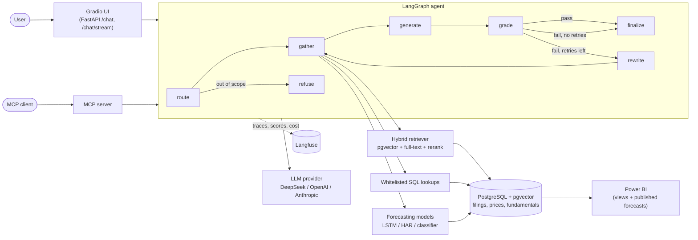

# Architecture

## System overview

## One question, step by step

1. **route**: the LLM classifies the question and picks tools. Out-of-scope requests (trades,
   personalized advice, prompt-override attempts) are refused here, before any tool runs.
2. **gather**: filing search (hybrid + rerank), the trained forecasters, and whitelisted read-only SQL.
   Forecasts and lookups run once; only the filing search is repeated on a retry.
3. **generate**: a cited draft, using only the retrieved context. Filing excerpts are treated as
   untrusted data (injection-looking lines are stripped, excerpts are wrapped in tags).
4. **grade**: a judge model scores grounding and relevance. Failing drafts go through **rewrite**
   (a better search query from the reviewer's feedback) and another pass, at most `AGENT_MAX_RETRIES`
   times (default 2), with a LangGraph recursion limit as a second guard.
5. **finalize**: citations are verified against what was actually retrieved; the Pydantic
   `AgentAnswer` is returned with the quality verdict, so the UI can say when an answer was not verified.

## Data flow

| Stage | What happens | Where |
|---|---|---|
| Ingest | yfinance prices and fundamentals; SEC EDGAR 10-K/10-Q text cleaned and chunked by `Item` section; chunks embedded with a local sentence-transformer | `data/` |
| Train | pooled LSTM and statistical baselines on a chronological split with purged boundaries; MLflow tracking; versioned bundle in `artifacts/models/` | `models/` |
| Serve | FastAPI + SSE streaming, Gradio UI, rate limiting, request IDs | `api/`, `viz/` |
| Observe | one Langfuse trace per question with tokens, cost, latency and quality scores | `observability/` |
| Evaluate | golden set, deterministic checks, RAGAS, DeepEval CI gate, retrieval ablation | `eval/` |
| Publish | latest forecasts and an out-of-sample volatility backtest written back to Postgres for BI | `models/publish.py` |

## Why Postgres for everything

One database holds the vector index (pgvector, HNSW), keyword index (GIN full-text), the price and
fundamentals tables, and the published model output. That keeps hybrid retrieval to a single round
trip, lets the SQL tool and the BI dashboard read the same data, and means one thing to deploy.
The trade-off is that very large corpora would want a dedicated vector store; at about 5,400 chunks
this is not a constraint. See [ADR 0005](adr/0005-postgres-for-everything.md).
